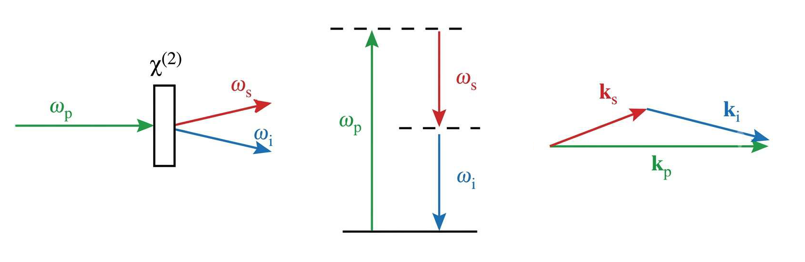

# Quantum Imaging with Undetected Light

Many molecules exhibit strong absorption features in the mid-infrared spectral range, while
cameras operating in this range are expensive, prone to noise, and offer lower resolution
than conventional Si visible-range cameras. Such challenges can be addressed by exploiting
quantum correlation between entangled photon pairs 
generated in processes such as Spontaneous Parametric Down Conversion (SPDC).
This allows an object to be probed with a photon of one wavelength,
while its correlated partner of another wavelength is detected.

Described approach, known as Quantum Imaging with Undetected Light (QIUL), decouples the
illumination and detection wavelengths, enabling imaging in spectral regions where suitable
detectors are unavailable or perform poorly at the sample probing wavelength, giving it
advantage over conventional imaging methods.

This repository contains classes for computational modeling of SPDC source
and the entire QIUL setup and can generate the following:
- SPDC transition-rate spectra
- Phase-matching contours
- Signal and idler wavelength distributions
- Constructive and destructive detector images
- Visibility maps
- Object-plane kernels / PSFs
- Convolved object-plane visibility maps
- Detector-plane projections
- Vertical visibility profiles
- Resolution curves
- NumPy data files and publication-ready figures

Already know what to do? Jump straight to the [Requirements](#requirements)

Project is based on the following work:
F. Riexinger,
_Simulation Methods for Spontaneous Parametric Down-Conversion 
and Quantum-Sensing Systems with Undetected Light_,
PhD Thesis (2023)
in which a detailed theoretical derivation can also be found.

> This repository accompanies a master's thesis on numerical modeling of SPDC 
> and quantum imaging with undetected light which is available as part of this repo
> (at the moment only in Serbian).

## What's in this directory

- [src](src):
  - [simulations.py](src/simulations.py): Implements two classes: `SPDC` and `Imaging`.
    - `SPDC` class defines the nonlinear source. 
    It initializes the crystal, pump, signal, idler, sampling grids, and rate prefactors;
    samples idler states using quasi-Monte Carlo integration; 
    evaluates phase matching; performs adaptive stopping; 
    and computes transition rates in parallel.
    - `Imaging` class propagates signal and idler photons through the imaging system.
    It evaluates the object transmission and phase, accumulates constructive and destructive detector images,
    and calculates visibility using full system simulation.
    It also obtains the imaging kernel and performs convolution-based simulation.
  - [object_func.py](src/object_funcs.py): Implements mathematical representation of objects for imaging in the form:
    ```
    def object_func(x, y):
        return transmission, phase
    ```
  - 
- [tests](test):

## SPDC Simulation

Spontaneous Parametric Down-Conversion is a second order nonlinear process in which
one _pump_ photon is converted into two photons of lower frequency, denoted as _signal_ and
_idler_. Key parameters for this simulation are pump wavelength $\lambda_p$, power $P$, beam waist $\omega_0$,
crystal length $L$, temperature $T$, and effective nonlinear susceptibility $\chi_{\mathrm{eff}}^{(2)}$
of the crystal.



### Phase matching

Efficient photon-pair generation requires phase matching conditions to be fulfilled.
These are equivalent to energy and momentum conservation conditions:
$$
\omega_p = \omega_s + \omega_i
\qquad
\mathbf{k_p} = \mathbf{k_s} + \mathbf{k_i} + \mathbf{k_m},
$$
where $k_m$ is the quasi-phase-matching momentum produced by periodic poling of the crystal.

We can also define the transverse momentum mismatch as
$$
\Delta k_x = k_{p,x}-k_{s,x}-k_{i,x},
\qquad
\Delta k_y = k_{p,y}-k_{s,y}-k_{i,y},
$$
and the longitudinal mismatch as
$$
\Delta k_z = k_{p,z}-k_{s,z}-k_{i,z}+k_m.
$$

### Pump field

The pump is modelled as a Gaussian beam propagating along the $z$-axis:
$$
E(\mathbf r) = E_0
\exp\left[-\frac{x^2+y^2}{\omega_0^2}\right]
e^{-ik_p z}e^{i\omega_p t}.
$$
Its amplitude is determined by the pump power \(P\):
$$
E_0 = \sqrt{\frac{2P}{\pi\omega_0^2\varepsilon_0 c n_p}}.
$$

### SPDC transition rate

The Gaussian pump produces the transverse weighting
$$
\exp\left[-\frac{\omega_0^2(\Delta k_x^2+\Delta k_y^2)}{2}\right],
$$
and the finite crystal length produces the longitudinal phase-matching factor
$$
\operatorname{sinc}^2\left(\frac{\Delta k_zL}{2}\right).
$$
Therefore we get the differential transition rate for generating signal photons with:
wavelength in the interval $[\lambda_s, \lambda_s + d\lambda_s]$ and 
polar angle in the interval $[\theta_s, \theta_s + d\theta_s]$:
$$
dR(\lambda_s, \theta_s) =
\sum_m \frac{4 P L^2 T_I \omega_0^2}{\varepsilon_0^3 (2\pi)^7 m^2 c n_p}
\int_0^{2\pi} d\phi_s \int_{\mathbb{R}^3} d\mathbf{k}_i \,
\Bigl[
\bigl(\chi_{\mathrm{eff}}^{(2)}(\mathbf{k}_p, \epsilon_p, \mathbf{k}_s, \epsilon_s, \mathbf{k}_i, \epsilon_i)\bigr)^2
\frac{|\mathbf{k}_s|^4 \omega_s \omega_i}{n_s^2 n_i^2}
\operatorname{sinc}^2\!\left(\frac{\Delta\omega\, T_I}{2}\right)
\operatorname{sinc}^2\!\left(\frac{\Delta k_z L}{2}\right)
e^{-\frac{\omega_0^2 (\Delta k_x^2 + \Delta k_y^2)}{2}}
\Bigr]
\sin\theta_s \, d\theta_s \, d\lambda_s.
$$
We calculate this integral numerically using Quasy Monte Carlo integration.

### Interaction time
The interaction time represents time during which pump field interacts with the crystal and 
is calculated from the pump group velocity in the crystal:
$$
T_I = \frac{L}{v_g}
= \frac{Ln_g}{c}
= \frac{L}{c}\left(n_p-\lambda_p\frac{dn_p}{d\lambda_p}\right).
$$
Two regimes are explored based on the values of this parameter:
- **Continuous-wave approximation:** T_I is considered to be infinite and energy conservation is imposed directly.
- **Finite interaction time:** the spectral weighting $\operatorname{sinc}^2(\Delta\omega T_I/2)$ is retained.

### Numerical integration

The multidimensional transition-rate integral is evaluated using QMC method:
$$
I \approx \frac{1}{N}\sum_{j=1}^{N}\frac{f(\mathbf{x}_j)}{p(\mathbf{x}_j)},
$$
where $f$ is the physical integrand, $p$ is the sampling density, and $\mathbf{x}_j$ are sampled points.
The transverse momentum mismatches are sampled from Gaussian distributions determined by the pump waist.
For finite interaction time, the code samples the longitudinal mismatch through an approximation 
to the $\operatorname{sinc}^2$ distribution using a three-Gaussian mixture.
This concentrates samples near the dominant central and first side maxima.


### Adaptive stopping

The simulation evaluates running means and uncertainties as idler samples are accumulated.
Sampling is terminated when the absolute or relative error falls below a user-defined threshold 
for a required number of consecutive checks. 
This is done since not all parts of spectrum need equal amount of evaluations.

### Parallelization

The signal grid is divided into independent batches.
Batches are distributed across multiple worker processes using `multiprocessing.Pool`,
and their results are recombined in the correct signal-grid order.


## QIUL Simulation

The experimental work focuses on the development and
optimization of an interferometric setup in Michelson SU(1,1)
geometry. The system utilizes double-pass SPDC generation
in a periodically poled KTP (ppKTP) crystal. 
The idler produced in the first pass interacts with the object,
while the signal contribution is detected after interference 
with the signal created during the second pass. Due to the momentum
correlation between the idler and the signal from the first pass,
the signal photon has the information about the object,
although it never interacts with it. Signals from both passes
are then combined in the detector arm, and information about
object can be obtained from their interference.
The simulation forms constructive and destructive interference detector images,
$\Gamma^+$ and $\Gamma^-$, and calculates the visibility:
$$
V(x,y) =
\frac{\Gamma^+(x,y)-\Gamma^-(x,y)}
{\Gamma^+(x,y)+\Gamma^-(x,y)}.
$$

In the idealized model we have:
$$
V \propto t_o\cos(\phi_o).
$$

### Source

This simulation does not depend on using a specific source.
Source class must have some attributes like pump wavelength, central signal wavelength, etc.
and a method for sampling source photons,
but in general imaging simulation is adaptable to sources other than SPDC.

### Propagation through the Setup

Created samples are then propagated through the setup using transfer matrix method.
When performing propagation we need to take into account 
all the optical elements that are in the path of signal/idler photons.
To do this a specialized class is ImagingSystem is created.
Different imaging systems will have their own classes and define their own elements
but they must always inherit from ImagingSystem and override some of its methods.

Photon contributions are in the end assigned to detector or object-plane pixels
according to their final coordinates (binning step). 
In this way interference and visibility images can be generated.

### Faster Way: Convolution-based imaging

The full Monte Carlo calculation described above is computationally expensive.
If the imaging response is approximately translation invariant over the studied field
(which happens in paraxial approximation),
the object-plane visibility can be approximated by convolution with a normalized imaging kernel:
$$
V(\rho_D) =
t_i\int \hat{A}(k_s-k_i)
t_o\bigl(\rho_O(k_i)\bigr)
\,dk_i.
$$
This approach (when applicable) is useful for repeated object simulations, resolution scans, and parameter sweeps.
It is most reliable near the central detector region;
large off-axis angles can violate the translation-invariance approximation.

The kernel is found by selecting signal states propagating to the detector center
and histogramming the associated idler positions in the object plane.

Convolution of this kernel with object function gives us object plane visibility
which then needs to be scaled using system magnification factor to obtain detector visibility

### Setup Resolution Analysis

Resolution is evaluated using two absorbing bars with variable gap.
The visibility profile is extracted along a selected vertical detector cut,
and a Rayleigh-like midpoint-recovery metric is calculated:
$$
R =
\frac{V_{\mathrm{middle}}-V_{\mathrm{bar}}}
{V_{\mathrm{background}}-V_{\mathrm{bar}}}.
$$
The pair is treated as resolved when $R \geq0.735$.

To determine the resolution one can first obtain FWHM of system PSF which should give a good guess on the value.
Then a scan can be performed using fast simulation method
to calculate visibility for varying gap sizes around that value.
Last gap value that satisfies the criterion is the setup resolution. 
To confirm this result precisely one could run full simulation on a few selected gap values,
although in our work this approach wasn't taken due to the lack of computing resources 
(since full simulation can only run on a very coarse grid 
its own resolution stands in way of determining setup resolution).


## Model assumptions and limitations

The model is designed to retain the main SPDC and imaging effects while remaining numerically tractable.
Its principal approximations include:
- photon pairs are treated as originating from a common effective crystal location;
- transverse variation of the creation point is neglected;
- additional propagation phases inside the crystal are neglected;
- optical elements are ideal;
- small alignment errors and aberrations are not included;
- air is approximated as vacuum during the medium-to-air transition;
- paraxial propagation is used where appropriate;
- the convolution method assumes an approximately translation-invariant kernel;
- finite detector and object-plane sampling affect reported resolution;
- the sampled $\operatorname{sinc}^2$ approximation may underrepresent higher-order side lobes of function.

## Requirements

Create and activate a virtual environment:
```bash
python -m venv .venv
source .venv/bin/activate
```

All requirements are listed in [requirements.txt](requirements.txt).
Install dependencies:
```bash
pip install -r requirements.txt
```

>The most computationally demanding operations are high-resolution signal grids,
> large idler sample counts and full detector simulations.
> For initial tests, use modest values such as in the example below.
```python
# Example:
grid_size = 32
N_phi = 16
min_N_i = 2**5
max_N_i = 2**8
detector_pixels = 128
object_plane_pixels = 256
```

Test scripts that showcase the use of class methods
are presented in the form of Python Notebooks in the [tests](tests) folder.
